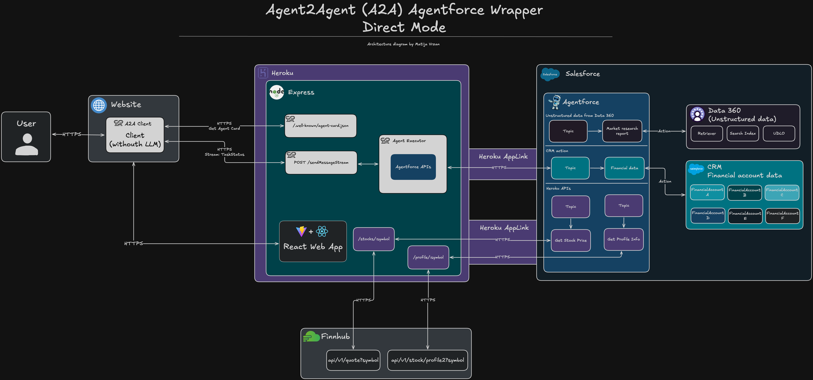
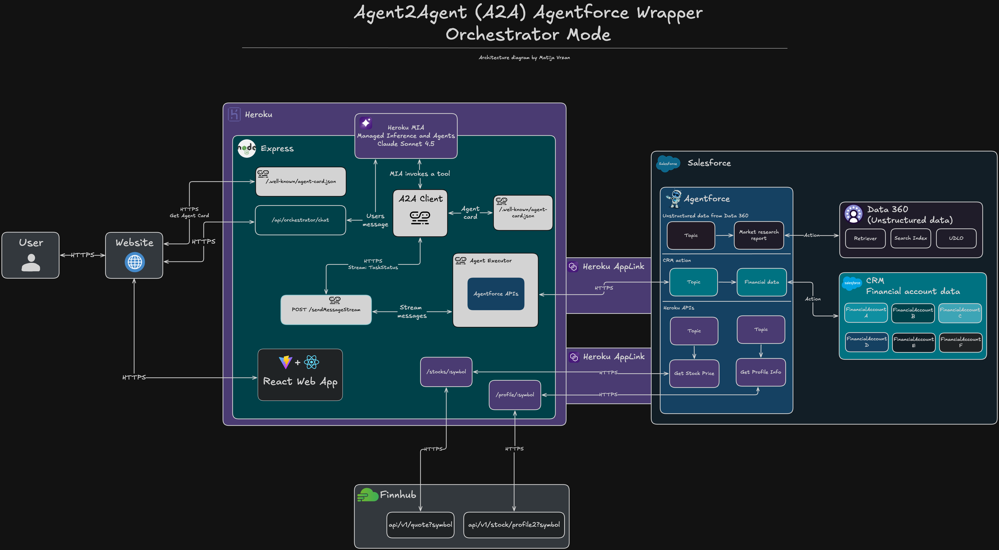

<p align="center">
<a href="https://www.salesforce.com/agentforce/"></a>
<a href="https://a2a.ai/"></a>
<a href="https://www.heroku.com/"></a>
<p/>

# Agentforce A2A Wrapper

Connect Salesforce Agentforce to the world through the Agent-to-Agent (A2A) Protocol with intelligent orchestration powered by Heroku Managed Inference and Agents.

---

# Table of Contents

- [Agentforce A2A Wrapper](#agentforce-a2a-wrapper)
- [Table of Contents](#table-of-contents)
  - [What does it do?](#what-does-it-do)
  - [How does it work?](#how-does-it-work)
  - [Demo](#demo)
    - [Orchestrator Mode](#orchestrator-mode)
    - [Direct A2A Mode](#direct-a2a-mode)
    - [Architecture Diagram - Direct Mode](#architecture-diagram---direct-mode)
    - [Architecture Diagram - Orchestrator Mode](#architecture-diagram---orchestrator-mode)
  - [API Specification](#api-specification)
    - [A2A Protocol Endpoints](#a2a-protocol-endpoints)
    - [Orchestrator Endpoint](#orchestrator-endpoint)
    - [Agent Action Endpoints](#agent-action-endpoints)
  - [Technologies Used](#technologies-used)
- [Configuration](#configuration)
  - [Requirements](#requirements)
  - [Setup](#setup)
    - [Local Environment Configuration](#local-environment-configuration)
  - [Deployment](#deployment)
    - [Heroku Deployment](#heroku-deployment)
- [License](#license)
- [Disclaimer](#disclaimer)

---

## What does it do?

This application demonstrates how to **expose Salesforce [Agentforce ](https://www.salesforce.com/ca/agentforce/)agents through the A2A (Agent-to-Agent) Protocol** while adding an intelligent orchestration layer powered by **[Heroku Managed Inference and Agents (MIA)](https://www.heroku.com/ai/managed-inference-and-agents/)**.

The demo showcases two operational modes:

**Orchestrator Mode** - True agent-to-agent communication where:

- User queries first reach Heroku MIA (Claude 4.5 Sonnet)
- MIA intelligently decides when to delegate to the Agentforce financial agent
- Agentforce performs specialized financial tasks (stock prices, company data)
- MIA synthesizes the information into conversational responses
- Creates a seamless multi-agent collaboration experience

**Direct Mode** - Pure A2A protocol implementation:

- Direct client-to-Agentforce communication following A2A specifications
- Demonstrates standard agent discovery and streaming capabilities
- Shows session caching for performance optimization (30-minute TTL)
- Reduces latency from ~5s to <1s on subsequent requests

Key capabilities:

- **A2A Protocol Compliance**: Full implementation of agent card discovery and JSON-RPC messaging
- **Real-time Streaming**: Server-Sent Events (SSE) for immediate response delivery
- **Heroku Managed Inference and Agents**: Easily add LLM capabilities to your application
- **Heroku AppLink Integration**: Secure Salesforce authentication and API invocations
- **Function Calling**: Tool-based architecture allowing MIA to delegate specialized tasks
- **Dual Architecture**: Toggle between orchestrated and direct agent communication

---

## How does it work?

**Orchestrator Mode Flow:**

1. **Initial Request**: User sends a message through the chat interface
2. **MIA Routing**: Request reaches Heroku Managed Inference and Agents (Claude 4.5 Sonnet)
3. **Decision Making**: MIA analyzes the query and decides if it requires financial agent assistance
4. **Tool Invocation**: For financial queries, MIA calls the `query_agentforce` function
5. **A2A Communication**: Server acts as A2A client to communicate with Agentforce
6. **Agent Execution**: Agentforce processes the request using Heroku AppLink for Salesforce API calls
7. **Data Retrieval**: Agent fetches stock prices, company profiles, or earnings data
8. **Response Synthesis**: MIA receives the tool result and generates a conversational response
9. **Streaming Display**: Response streams back to user via SSE in real-time

**Direct A2A Mode Flow:**

1. **Agent Discovery**: Client fetches agent card from `/.well-known/a2a/agentcard.json`
2. **Session Creation**: First message creates a new Agentforce session (cached for 30 minutes)
3. **Message Streaming**: User message sent via A2A JSON-RPC protocol
4. **Agent Processing**: FinancialAgentExecutor handles the request with session reuse
5. **Salesforce Integration**: Heroku AppLink provides authorized access to Salesforce APIs
6. **Real-time Streaming**: Artifact-update events push response chunks immediately
7. **Client Rendering**: React frontend displays streaming responses with markdown formatting

**Session Caching Architecture:**

- **First Request**: ~5 seconds (creates new Agentforce session)
- **Cached Requests**: <1 second (reuses existing session)
- **TTL Management**: 30-minute timeout with automatic cleanup
- **Error Recovery**: Failed sessions removed from cache, forcing fresh creation
- **Context Isolation**: Each A2A context gets its own cached session

**Authentication & Security:**

- **Heroku AppLink**: OAuth 2.0 for Salesforce API authentication
- **HMAC-SHA256**: Request signature validation for protected endpoints
- **Environment Detection**: Automatic URL configuration for localhost vs production
- **Token Management**: Bearer token authentication for Heroku MIA

---

## Demo

> **Note**: Screenshots folder is empty. Please add the following:
>
> - Demo GIF showing orchestrator mode
> - Screenshot of direct mode
> - Architecture diagram
> - Chat interface examples

### Orchestrator Mode

_Screenshot showing Heroku MIA deciding when to call Agentforce_

### Direct A2A Mode

_Screenshot showing direct A2A client-to-agent communication_

### Architecture Diagram - Direct Mode



### Architecture Diagram - Orchestrator Mode



---

## API Specification

### A2A Protocol Endpoints

**GET `/.well-known/a2a/agentcard.json`**

- Returns the A2A agent card for agent discovery
- No authentication required
- Response includes agent capabilities, identity, and service configuration

**POST `/a2a/jsonrpc`**

- JSON-RPC 2.0 endpoint for A2A protocol messages
- Handles `agent.sendMessage`, `agent.startTask`, and streaming task execution
- Uses A2A SDK `jsonRpcHandler` for protocol compliance
- Returns streaming task updates via artifact-update events

**POST `/a2a/rest`**

- RESTful alternative to JSON-RPC endpoint
- Same functionality as JSON-RPC but with REST semantics
- Uses A2A SDK `restHandler` for protocol compliance

### Orchestrator Endpoint

**POST `/api/orchestrator/chat`**

- Intelligent agent orchestration powered by Heroku MIA
- Headers: `Content-Type: application/json`
- Body: `{ messages: Array<{ role: "user" | "assistant" | "system", content: string }> }`
- Returns: Server-Sent Events stream with content and tool results
- Event Types:
  - `{ type: "content", content: string }` - Streaming response chunks
  - `{ type: "tool_result", tool: "agentforce", content: string }` - Agentforce responses
  - `data: [DONE]` - Stream completion marker

**Authentication:**
Bearer token authentication using `INFERENCE_KEY` environment variable

### Agent Action Endpoints

> **⚠️ INTERNAL TESTING ENDPOINTS ONLY ⚠️**
>
> These endpoints bypass the A2A protocol and orchestrator layers.
> They are provided for direct Agentforce API testing and debugging only.

**POST `/api/agentforce/start-session`**

- Directly creates an Agentforce session
- Headers: `X-Timestamp`, `X-Signature`, `Content-Type: application/json`
- Body: `{ externalSessionKey: string }`
- Returns: `{ sessionId: string, messages: Array }`

**POST `/api/agentforce/send-message`**

- Sends message to existing Agentforce session with streaming
- Headers: `X-Timestamp`, `X-Signature`, `Content-Type: application/json`
- Body: `{ sessionId: string, message: string, sequenceId: number }`
- Returns: Server-Sent Events stream

**DELETE `/api/agentforce/delete-session`**

- Terminates an active Agentforce session
- Headers: `X-Timestamp`, `X-Signature`, `Content-Type: application/json`
- Body: `{ sessionId: string }`
- Returns: `{ success: true }`

**GET `/api/agent-actions/stock-price/:symbol`**

- Retrieves current stock price for a symbol
- Headers: `X-Timestamp`, `X-Signature`
- Returns: `{ symbol: string, price: number, ... }`

**GET `/api/agent-actions/company-profile/:symbol`**

- Fetches detailed company profile information
- Headers: `X-Timestamp`, `X-Signature`
- Returns: `{ name: string, industry: string, ... }`

**Authentication for Agent Actions:**
All requests require HMAC-SHA256 signature in headers:

- `X-Timestamp`: Current timestamp in milliseconds
- `X-Signature`: HMAC-SHA256(API_SECRET, timestamp + method + path)

---

## Technologies Used

**Client**

- [React](https://react.dev/) - 19.2.0 - UI framework
- [TypeScript](https://www.typescriptlang.org/) - Type-safe JavaScript
- [Vite](https://vitejs.dev/) - Build tool and dev server
- [Tailwind CSS](https://tailwindcss.com/) - 4.1.18 - Utility-first CSS framework
- [react-markdown](https://github.com/remarkjs/react-markdown) - Markdown rendering for chat messages
- [A2A SDK](https://www.npmjs.com/package/@a2a-js/sdk) - 0.3.9 - Agent-to-Agent Protocol JavaScript SDK

**Server**

- [Node.js](https://nodejs.org/en) - JavaScript runtime
- [Express](https://expressjs.com/) - 5.2.1 - Web framework
- [A2A SDK](https://www.npmjs.com/package/@a2a-js/sdk) - 0.3.9 - A2A Protocol server implementation
- [Heroku AppLink](https://www.npmjs.com/package/@heroku/applink) - Salesforce authentication and API access
- [Salesforce Einstein Agentforce API v1](https://developer.salesforce.com/docs/einstein/genai/guide/agent-api.html) - AI agent integration
- [Heroku Managed Inference and Agents](https://www.heroku.com/inference) - Claude 4.5 Sonnet orchestration
- [TypeScript](https://www.typescriptlang.org/) - Type-safe JavaScript
- [HMAC-SHA256](https://nodejs.org/api/crypto.html#cryptocreatehmacalgorithm-key-options) - Request signature validation

For a more detailed overview of the development & production dependencies, please check server [`package.json`](./server/package.json) or client [`package.json`](./client/package.json).

---

# Configuration

## Requirements

To run this application locally, you will need the following:

- **Node.js** version 20 or later installed (type `node -v` in your terminal to check). Follow [instructions](https://nodejs.org/en/download) if you don't have node installed
- **npm** version 10.0.0 or later installed (type `npm -v` in your terminal to check). Node.js includes `npm`
- **git** installed. Follow the instructions to [install git](https://git-scm.com/downloads)
- A [Salesforce](https://www.salesforce.com) account enabled with [Agentforce](https://www.salesforce.com/agentforce/)
- **Heroku account** with access to [Managed Inference and Agents](https://www.heroku.com/inference)
- **Heroku AppLink** setup in your Salesforce org (see setup instructions below)
- (Optional) **Finnhub API key** if you want to use external financial data API

---

## Setup

### Local Environment Configuration

1. **Clone the repository**

   ```bash
   git clone https://github.com/mvrzan/salesforce-agentforce-a2a-wrapper.git
   cd salesforce-agentforce-a2a-wrapper
   ```

2. **Configure Heroku AppLink**

   > **Important**: This application uses Heroku AppLink to authenticate with Salesforce. You need to configure AppLink in your Salesforce org first.

   Follow the [Heroku AppLink documentation](https://devcenter.heroku.com/articles/applink) to:
   - Create a Connected App in Salesforce
   - Configure OAuth scopes (api, refresh_token, offline_access)
   - Add your Heroku app to the AppLink configuration

3. **Configure Server Environment Variables**

   Copy the example file and fill in your credentials:

   ```bash
   cd server/src
   cp .env.example .env
   ```

   Edit `server/src/.env` with your values:

   ```bash
   # Salesforce Agentforce Configuration
   AGENTFORCE_AGENT_ID=your_agentforce_agent_id

   # Heroku AppLink Configuration
   APP_LINK_CONNECTION_NAME=your_applink_connection_name

   # Heroku Managed Inference and Agents (Claude 4.5 Sonnet)
   INFERENCE_URL=https://us.inference.heroku.com
   INFERENCE_KEY=your_heroku_inference_api_key
   INFERENCE_MODEL_ID=claude-4-5-sonnet

   # API Security
   API_SECRET=your_generated_secret_key

   # Server Configuration
   APP_URL=http://localhost:3000
   APP_PORT=3000

   # External APIs (Optional)
   FINHUB_API_KEY=your_finhub_api_key
   ```

   Generate a secure API secret:

   ```bash
   node -e "console.log(require('crypto').randomBytes(32).toString('hex'))"
   ```

   ⚠️ **Note**: The client does not require environment variables. It automatically detects whether it's running on localhost or in production and adjusts API URLs accordingly.

4. **Install Dependencies**

   Install server dependencies:

   ```bash
   cd ../server
   npm install
   ```

   Install client dependencies:

   ```bash
   cd ../client
   npm install
   ```

5. **Start the Application**

   Start the server (from the `server` directory):

   ```bash
   npm run dev
   ```

   In a new terminal, start the client (from the `client` directory):

   ```bash
   npm run dev
   ```

6. **Access the Application**

   Open your browser and navigate to `http://localhost:5173`

---

## Deployment

### Heroku Deployment

Once you are happy with your application, you can deploy it to Heroku!

**Prerequisites:**

- [Heroku CLI](https://devcenter.heroku.com/articles/heroku-cli) installed
- Heroku account created
- Heroku AppLink configured in your Salesforce org

**Deployment Steps:**

1. **Create a Heroku App**

   ```bash
   heroku create your-app-name
   ```

2. **Set Environment Variables**

   Configure all required environment variables in Heroku:

   ```bash
   heroku config:set AGENTFORCE_AGENT_ID=your_agentforce_agent_id
   heroku config:set APP_LINK_CONNECTION_NAME=your_applink_connection_name
   heroku config:set INFERENCE_URL=https://us.inference.heroku.com
   heroku config:set INFERENCE_KEY=your_heroku_inference_api_key
   heroku config:set INFERENCE_MODEL_ID=claude-4-5-sonnet
   heroku config:set API_SECRET=your_generated_secret_key
   heroku config:set FINHUB_API_KEY=your_finhub_api_key
   ```

3. **Configure AppLink Addon**

   Add and configure the Heroku AppLink addon:

   ```bash
   heroku addons:create applink
   heroku addons:info applink
   ```

   Follow the prompts to connect your Salesforce org.

4. **Build and Deploy Client**

   Build the client:

   ```bash
   cd client
   npm run build
   ```

   The built files will be in `client/dist/` and are served by the Express server.

   **Note:** The client automatically detects the production environment and uses the appropriate API URL (no environment variables needed).

5. **Deploy to Heroku**

   ```bash
   git push heroku main
   ```

6. **Open Your App**

   ```bash
   heroku open
   ```

For more detailed deployment instructions, please follow the [official Heroku documentation](https://devcenter.heroku.com/articles/git).

---

# License

[MIT](http://www.opensource.org/licenses/mit-license.html)

---

# Disclaimer

This software is to be considered "sample code", a Type B Deliverable, and is delivered "as-is" to the user. Salesforce bears no responsibility to support the use or implementation of this software.
